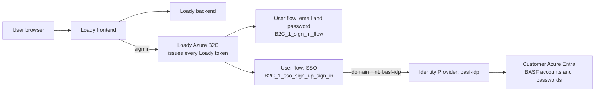
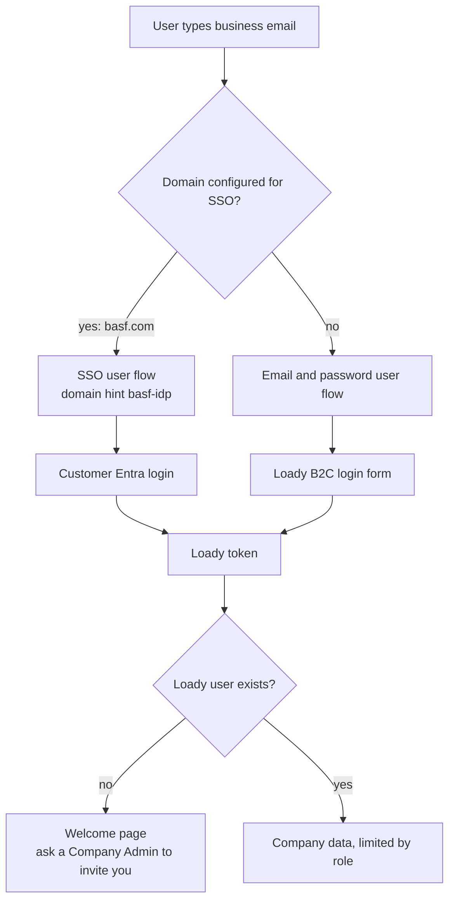
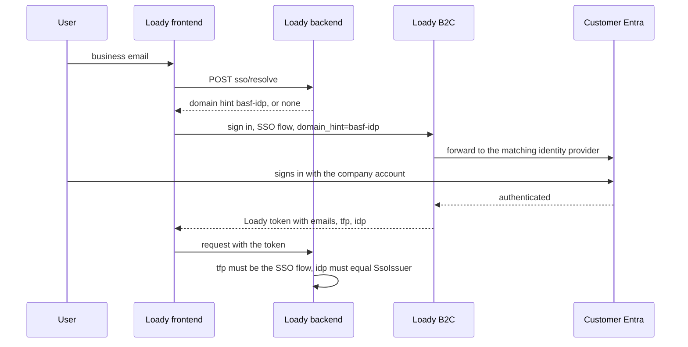

# SSO login for company users

Users from a configured company sign in with their work account instead of a Loady password.
Signing in alone gives no access: a Company Admin still has to invite the user to a company with a role.

## Terminology

- **SSO**: the user authenticates with their company account, no Loady password exists.
- **Identity Provider**: an entry in Loady's B2C pointing to one customer's login service, e.g. BASF's Entra.
- **User Flow**: the sign-in workflow in Loady's B2C. One for email and password, one for SSO.

## The pieces



Loady's B2C always issues the token. On the SSO flow it checks no password itself, it forwards the user to the
customer's Entra and trusts the answer. The domain hint tells it which customer to forward to.

## How the login works



1. User types their business email. Loady checks the domain: SSO configured means their company login, otherwise the normal password screen.
2. Loady's B2C picks the customer's identity provider by domain hint and forwards the user there.
3. User signs in at their company and returns to a welcome page. No Loady account exists yet.
4. Company Admin invites the email and picks a role. No password account, no password email.
5. User is asked once for first and last name, then works normally.

## Where the domain hint and the checks fit



## What the customer provides

- OpenID Connect metadata url of their tenant
- Client ID and client secretC
- Permission for Loady to receive the user's email address
- Loady's B2C reply url allowed on their app: `https://<loady-b2c>.b2clogin.com/<loady-b2c-tenant>/oauth2/authresp`

Authorization code flow, no implicit flow.

## Loady setup: user flow (once per environment)

Azure AD B2C → User flows → New user flow → Sign up and sign in + Recommended

- Name: `B2C_1_sso_sign_up_sign_in`
- Local accounts: all unchecked
- Custom identity providers: check every active SSO provider
- MFA: type `Email`, enforcement `Off`
- Application claims: **Email Addresses** and **Identity Provider** only

## Loady setup: identity provider (once per customer)

Azure AD B2C → Identity Providers → New OpenID Connect provider

- Name: `basf-idp`
- Metadata url: `https://login.microsoftonline.com/<customer-tenant-id>/v2.0/.well-known/openid-configuration`
- Client ID and secret: from the customer, keep the secret in the secret store
- Scope: `openid profile email`
- Response type: `code`
- Response mode: `form_post`
- Domain hint: `basf-idp`, must match `SsoDomainHint` below
- Claims mapping: User ID `sub`, Display name `name`, Email `preferred_username`

Every environment is configured separately. DEV does not carry over to QA, PG or PROD.

## Loady setup: company row (once per customer)

```sql
-- Enables SSO for TESTCOMPANY1. Needs the B2C SSO flow and provider configured in this environment.
-- Grants no access on its own, users must still be invited.
--
-- SsoEmailDomains: domains routed to SSO. JSON array, lowercase, no '@', exact match. A company can have several, e.g. basf.com and basf.eu.
-- SsoDomainHint:   must equal the "Domain hint" on the B2C OIDC provider. Just an opaque key for navigation, unrelated to any DNS domain.
-- SsoIssuer:       matched against the token's identityProvider claim. Take it from a decoded token. Hardens security and catches SSO misconfiguration.
-- IsSsoEnabled:    master switch. Needs hint and issuer set.
-- ManagedById NULL: top-level company only, never a business partner.
UPDATE Companies
SET SsoEmailDomains = '["basf.com"]',
    SsoDomainHint   = 'basf-idp',
    SsoIssuer       = 'https://login.microsoftonline.com/<customer-tenant-id>/v2.0',
    IsSsoEnabled    = 1
WHERE LoadyId = 'TESTCOMPANY1'
  AND ManagedById IS NULL;
```

One domain belongs to one company only. Two companies claiming `basf.com` blocks login for both.

## Verify

Sign in, decode the id token on jwt.ms:

- `emails`: exactly one address
- `tfp`: `B2C_1_sso_sign_up_sign_in`
- `idp`: present, and its value goes into `SsoIssuer`

## Test with your own Azure account

- Create a separate Azure account with Entra ID and test users
- Apply the Terraform in `loady-one/infra-sso-example` to register the SSO application there
- Add a Loady identity provider for your tenant, run the SQL for a test company
- Log in with a test user and walk through the five steps

## Good to know

- Turn SSO off with `IsSsoEnabled = 0`. Domains stay configured, logins fall back to password.
- An existing Loady user keeps their account, companies and roles. Identity is the email address.
- SSO users have no Loady password, so password reset does not apply.
